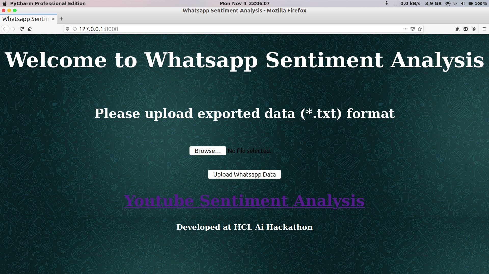
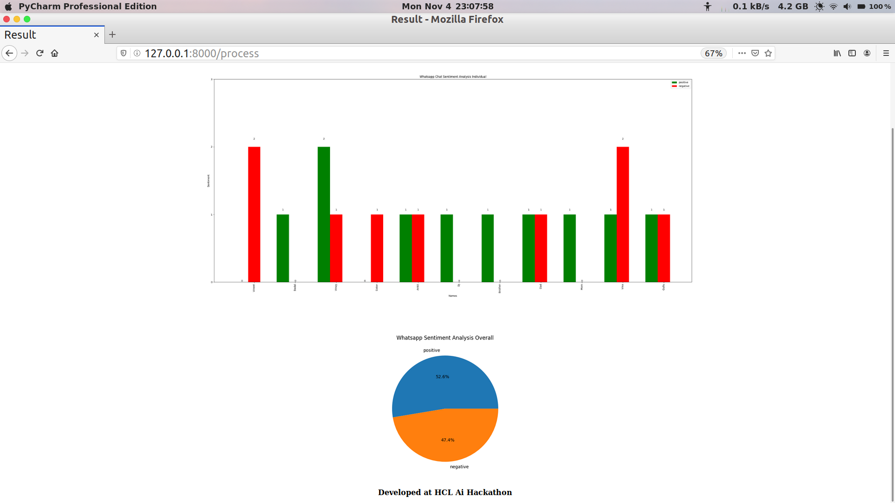
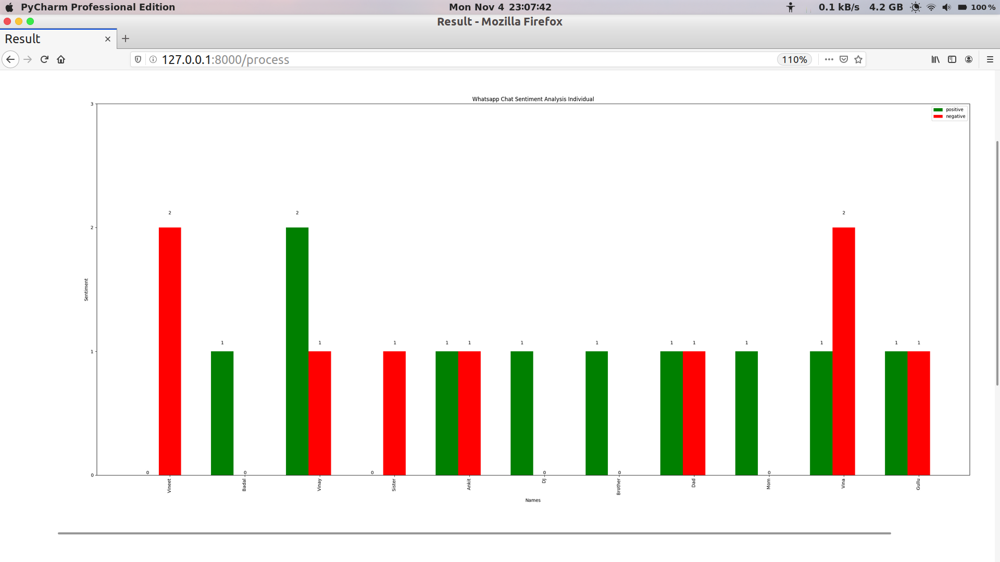
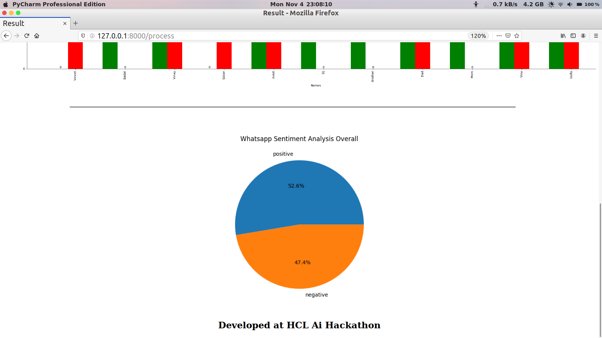
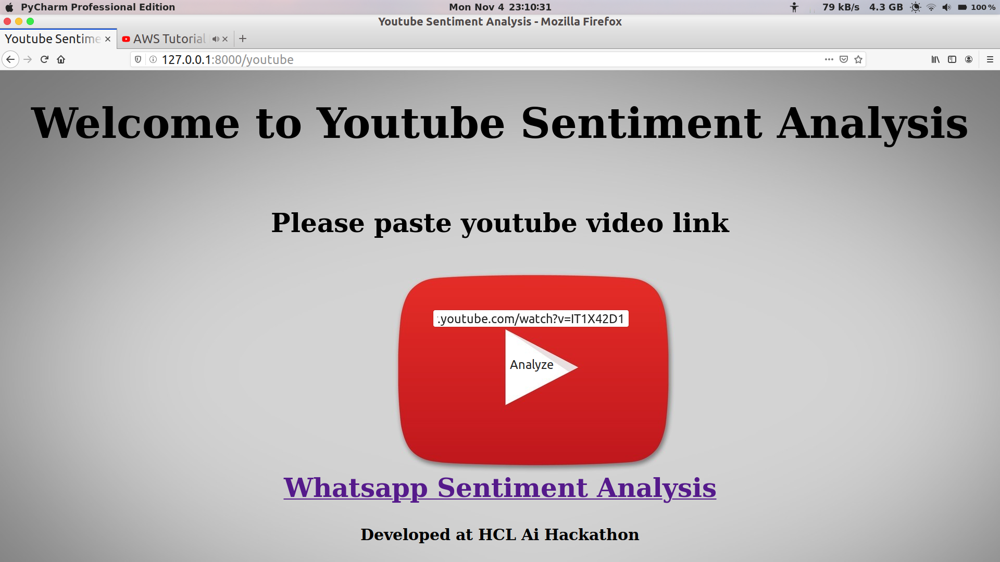
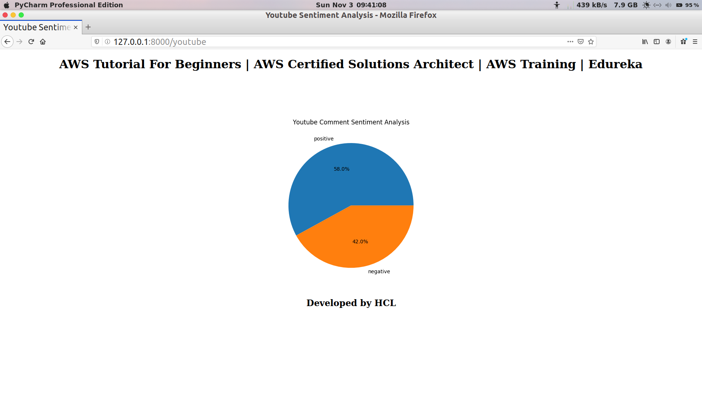

# HCL Ai Hackathon 2K19

## Whatsapp Sentiment Analysis
* Trainig Dataset: Movie reveiw nltk 
* Classifier: NaivBayes
* Testing Dataset: User Whatsapp chat exported text format
### Export Whatsapp Chat
1. Open Chat Click Option (Three dot)
2. Tap on more
3. Click Export chat
4. Without Media 
5. Now use *.txt file 

  
   
  
   

## Youtube Comment Sentiment Analysis

 * Same Model
 * From given link uses Selenium module grab all comments of youtube video and applying Sentiment Analysis
 
## Demo of WebApp

 
 
## Team

|     <a href="https://github.com/rizwansoaib" target="_blank">**RIZWAN AHMAD**      </a> | <a href="https://github.com/subahanii" target="_blank">**GHULAM MOHIYUDDIN**      </a> |<a href="https://github.com/avanish981" target="_blank">**AVANISH PRATAP SINGH**</a> |
|     :---:    |   :---:   |   :---:   | 
|     |  |  | 

| &nbsp;&nbsp; <a href="https://github.com/rizwansoaib" target="_blank">`  github.com/rizwansoaib `</a>  &nbsp;&nbsp; | &nbsp;&nbsp;&nbsp;&nbsp; <a href="https://github.com/subahanii" target="_blank">`   github.com/subahanii `</a>   &nbsp;&nbsp;&nbsp;&nbsp; |&nbsp;&nbsp;   <a href="https://github.com/avanish981" target="_blank">` github.com/avanish981  `</a> &nbsp;&nbsp;&nbsp;|
